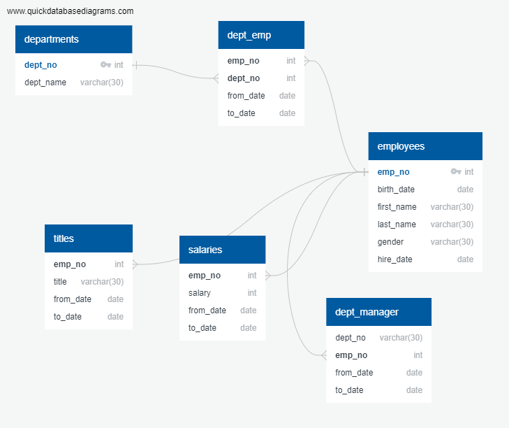

### SQL-challenge

## I) Data Modeling

### File Output: ERD-Employee_Database.png

## The above diagram show the relationship among table / CSV files. As can be seen, the unique code (or primary key) is located in "dept_no"
## under Departments database and "emp_no" under Employee database. Other database will use reference to those two. 

## II) Data Analysis 
### File Output: schema2.sql

## From the previous diagram in Data Modeling, we can create a table schema which specify the data type, primary key, and foreign key. 

## III) Data Engineering
### With variety of queries command in Postgress,  we can show the relation for these 8: 

* 1) List the following details of each employee: employee number, last name, first name, gender, and salary.

* 2) List employees who were hired in 1986.

* 3) List the manager of each department with the following information: department number, department name, the manager's employee number, last name, first name, and start and end employment dates.

* 4) List the department of each employee with the following information: employee number, last name, first name, and department name.

* 5) List all employees whose first name is "Hercules" and last names begin with "B."

* 6) List all employees in the Sales department, including their employee number, last name, first name, and department name.

* 7) List all employees in the Sales and Development departments, including their employee number, last name, first name, and department name.

* 8) In descending order, list the frequency count of employee last names, i.e., how many employees share each last name.

* It is worth noted that the same employee can be recorded more than one time and have more than one employee ID. The reason is that one employee can work in more than one department. 
* A detail look at "from_date" and "start_date" column will show us the different duration that employee has worked on each departments.   

## IV) Bonus